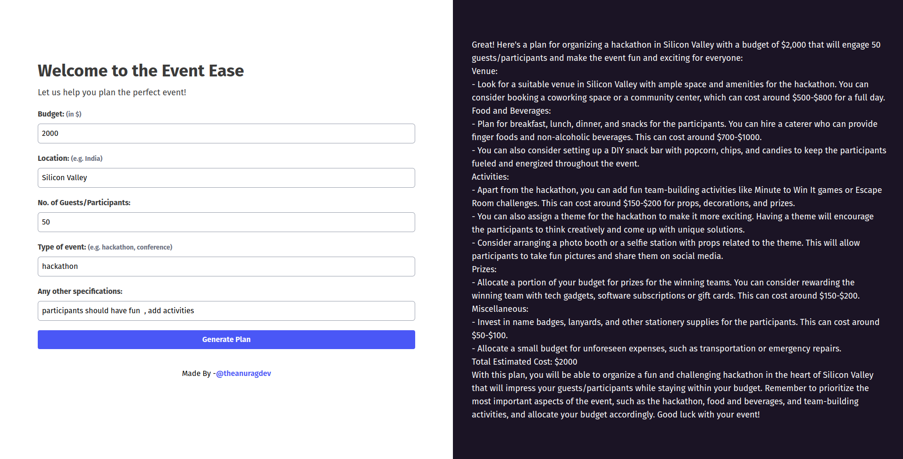

## Event Ease

Organizing an event can be stressful and overwhelming. Event Ease is here to make it easier for you to plan the perfect event. Whether it's a conference, wedding, or any other event, Event Ease helps you create a customized plan tailored to your needs and budget.

### Table of Contents
- Features
- Installation
- Usage
- Contributing
- License
### Features
- Create a customized event plan based on your budget, location, number of guests/participants, and type of event.
- Get recommendations on vendors, venues, and other services based on your preferences and budget.
- Save and share your event plan with others.
- Low budget? No problem. Event Ease will help you plan a great event no matter how much you have to spend.
### Installation
- Clone the repository: git clone https://github.com/anuragts/eventease.git
- Install dependencies: npm install
### Usage
- Run the app: npm run dev
- Open your browser and go to http://localhost:3000/
- Fill out the form with your event details and click "Generate Plan".
- View your customized event plan and vendor recommendations.
### Contributing
Contributions are always welcome! If you'd like to contribute to Event Ease, please follow these steps:

- Fork the repository.
- Create a new branch: git checkout -b feature/my-new-feature.
- Make your changes and commit them: git commit -am 'Add some feature'.
- Push to the branch: git push origin feature/my-new-feature.
- Submit a pull request.
### License
This project is licensed under the terms of the MIT license.